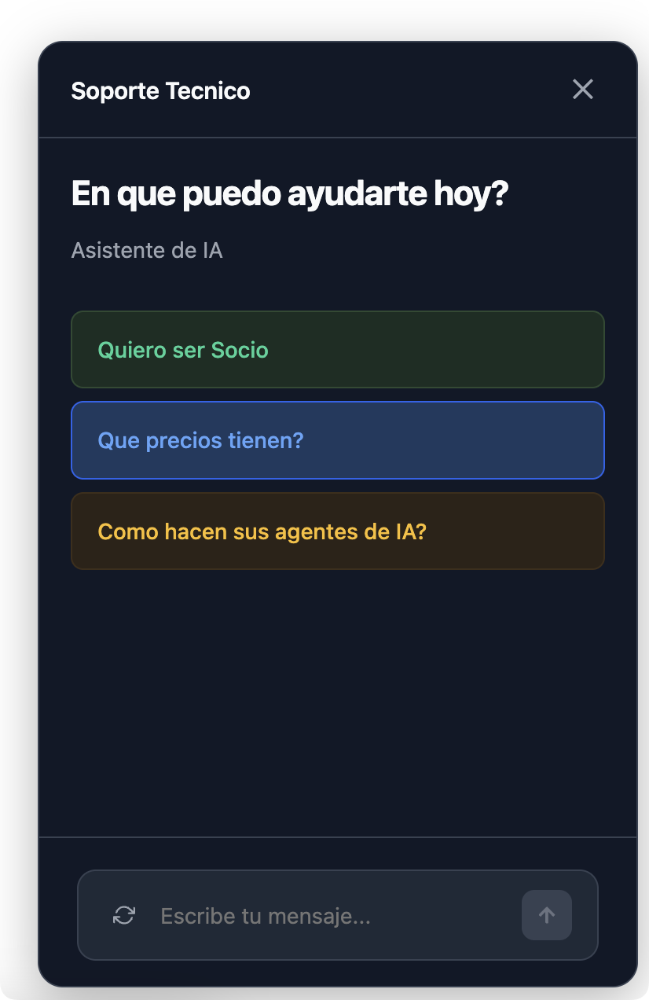
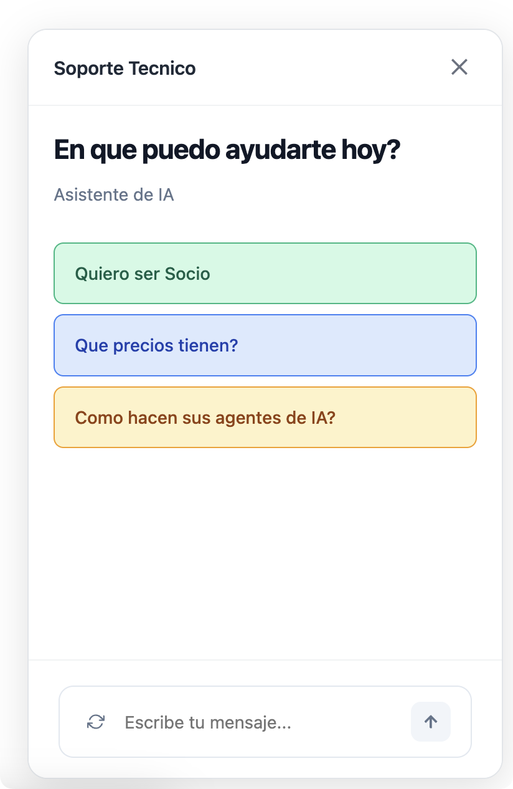

## 🚀 Plazbot SDK Examples

Create your AI agents extremely easily, connect them to your files, services API and yout prompt, and deploy them wherever you want, whether it's WhatsApp or our tools.

---

## 🤖 Overview

With the **Plazbot SDK**, you can build powerful, production-ready AI agents in minutes and connect them seamlessly to:

- 🌐 **Search Portals (ChatGPT-style AI search for websites)**
- 💬 **WhatsApp Messaging**
- 💻 **Web Widgets (fully embeddable)**

With just a few lines of code, you can:

- Create an agent with its own prompt, examples, and visual branding.
- Connect it to any supported channel.
- Start receiving and responding to messages with AI instantly.

The SDK is designed for developers who want to ship intelligent agents fast — whether for their own product or as part of a scalable solution for clients.

---

> 🧪 We’re currently in **Beta** for Plazbot SDK 2.0. Join the community and get free months, discounts, and early access perks. [Learn more ↓](#-lets-build-the-future-of-ai-agents--together)

---

## Installation

```bash
npm install plazbot
```

---

## Initialization

```ts
import { Agent, Portal, Message } from 'plazbot';

const bot = new Agent({
  workspaceId: "[YOUR_WORKSPACE_ID]",
  apiKey: "[YOUR_API_KEY]",
  zone: "LA" // Use "EU" for Europe
});

const portal = new Portal({
  workspaceId: "[YOUR_WORKSPACE_ID]",
  apiKey: "[YOUR_API_KEY]",
  zone: "LA" // Use "EU" for Europe
});

const message = new Message({
  workspaceId: "[YOUR_WORKSPACE_ID]",
  apiKey: "[YOUR_API_KEY]",
  zone: "LA" // Use "EU" for Europe
});
```

---

### **Agent Methods**

### Add/Update Agent
The agent is the most important part of the SDK. Here, you'll be able to create AI agents with certain characteristics and deploy them across different channels, whether it's the AI ​​Portal, Widget, or WhatsApp. You can also use our agent in any of your internal business tools, if you wish.

```ts
    const agent = await bot.addAgent(config);
    const agentId = agent.agentId;
```

```ts
    const agentUpdated = await bot.updateAgent(`agentId`, config);
```
To work with the agents, there is a JSON file that is the initial agent configurator which has the following structure. It's not necessary to fill out the entire file, but you can configure your agent however you like.

You can train the agent however you need, either through our configurator or if you want to configure everything in a single prompt; it's not necessary to use all the fields in the config file.

We're also providing a basic file for you to use in the repository.

```json
{
  "name": "Sales Clinic",
  "description": "Virtual Agent IA assistant of the Dental Clinic Smiles",
  "prompt": "You are a professional virtual assistant for Dental Clinic Smiles. You help patients with appointments, general information, and guide them through our services. Always be friendly, professional, and helpful. If you don't know something specific, direct them to contact our staff directly.",
  "zone": "LA",
  "buffer": 50,
  "color": "blue",
  "question": "How can I help you today?",
  "timezone": "America/Lima",
  "enable": true,
  "showInChat": true,
  "tags": [
    "health",
    "dentistry",
    "ia",
    "plazbot"
  ],
  "examples": [
    { "value": "How to be a partner??", "color": "green" },
    { "value": "Benefits of being members?", "color": "blue" },
    { "value": "Schedule an appointment", "color": "orange" },
    { "value": "What services do you offer?", "color": "gray" }
  ],
  "instructions": {
    "tone": "professional",
    "style": "short answers",
    "personality": "friendly",
    "objective": "help with clarity",
    "language": "es-419",
    "emojis": false,
    "preferredFormat": "plain text",
    "maxWords": 80,
    "avoidTopics": [
      "laboratory costs",
      "external claims"
    ],
    "respondOnlyIfKnows": true,
    "maintainToneBetweenMessages": true,
    "greeting": "Hello, I am Maximo"
  },
  "person": {
    "name": "Maximo",
    "role": "Virtual customer service assistant",
    "speaksInFirstPerson": true,
    "isHuman": false
  },
  "fallbacks": {
    "noAnswer": "Sorry, I don't have information on that topic.",
    "serviceError": "There was a problem processing your request. Please try again later.",
    "doNotUnderstand": "Could you please repeat it in another way?"
  },
  "rules": {
    "doNotMentionPrices": false,
    "doNotDiagnose": true,
    "doNotRespondOutsideHours": "Our hours are Monday to Saturday, from 8am to 6pm."
  },
  "enableWidget": true,
  "darkWidget": false,
  "nameWidget": "Dental Clinic Assistant",
  "initialShowWidget": false,
  "services": [
    {
      "intent": "schedule_date",
      "reference": "Service for recording patients' medical appointments at the clinic",
      "enabled": true,
      "method": "POST",
      "requiredFields": [ 
        { 
          "name": "nombre", 
          "description": "Nombre de la persona que quiere agendar la reunion.",
          "promptHint": "¿Podrías indicarme tu nombre completo, por favor?",
          "type": "string"
        },
        { 
          "name": "email",
          "description": "Correo electrónico de la personsa que quiere agendar la reunion.",
          "promptHint": "¿Cuál es tu dirección de correo electrónico para la cita?",
          "type": "email"
        },
        { 
          "name": "fecha",
          "description": "Fecha y hora preferida para la reunion.",
          "promptHint": "¿Qué día y hora te vendría bien para la reunión?",
          "type": "date"
        }
      ],
      "endpoint": "https://api.clinic.com/v1/date/schedule",
      "tags": ["appointment", "date", "booking"],
      "headers": {
        "Authorization": "Bearer {{apiKey}}",
        "Content-Type": "application/json"
      },
      "bodyTemplate": {
        "nombre": "{{nombre}}",
        "email": "{{email}}", 
        "fecha": "{{fecha}}"
      },
      "responseMapping": {
        "mensaje": "$.response.mensaje",
        "date": "$.response.date"
      },
      "responseMessage": "Tu cita ha sido registrada exitosamente para el {{date}}",
      "responseConditions": [
        {
          "condition": "$.response.status == 'success'",
          "message": "¡Perfecto! Tu cita ha sido confirmada para el {{date}}. Te enviaremos un recordatorio por email."
        },
        {
          "condition": "$.response.status == 'conflict'",
          "message": "Lo siento, ese horario ya está ocupado. ¿Te gustaría elegir otra fecha?"
        }
      ],
      "action": "schedule"
    },
    {
      "intent": "get_services",
      "reference": "Get list of available dental services",
      "enabled": true,
      "method": "GET",
      "requiredFields": [],
      "endpoint": "https://api.clinic.com/v1/services",
      "tags": ["services", "information"],
      "headers": {
        "Authorization": "Bearer {{apiKey}}",
        "Content-Type": "application/json"
      },
      "responseMapping": {
        "services": "$.data.services"
      },
      "responseMessage": "Here are our available services: {{services}}"
    }
  ],
  "actions": [
    {
      "intent": "transfer_to_human",
      "reference": "Transfer conversation to human agent",
      "tags": ["support", "human"],
      "enabled": true,
      "responseMessage": "I'm transferring you to one of our human specialists who can better assist you.",
      "responseJson": false,
      "action": [
        {
          "type": "action.asign",
          "value": "human-agent-id"
        },
        {
          "type": "action.tag",
          "value": "needs-human-support"
        }
      ]
    },
    {
      "intent": "set_urgent_priority",
      "reference": "Mark conversation as urgent",
      "tags": ["urgent", "priority"],
      "enabled": true,
      "responseMessage": "I've marked your case as urgent. Our team will prioritize your request.",
      "responseJson": false,
      "action": [
        {
          "type": "action.stage",
          "value": "urgent-stage-id"
        },
        {
          "type": "action.tag",
          "value": "urgent"
        }
      ]
    }
  ],
  "channels": [
    { "channel": "whatsapp", "key": "57123456789" },
    { "channel": "instagram", "key": "dental_clinic_smiles" },
    { "channel": "facebook", "key": "dental.clinic.smiles" }
  ]
}
```

**AI Agent Fields**

👉 The JSON obeys a preconfigured schema, so the field names and types must be respected.


| Name            | Description |
|-----------------|-------------|
| name            | Agent name. Visible text for identification. |
| prompt          | Custom instructions that define the agent's behavior. |
| buffer          | Number of messages stored to maintain context of a conversation, their values ​​range from 3 to 10 contexts. |
| color           | Visual color of the agent in the widget or portal. Options: blue, orange, gray, green, and white. Default: gray |
| question        | The Agent's main question, this question is the one that appears in the middle of the portal and also when you install the widget. |
| description     | AI Agent Description |
| zone            | The zone is a very important factor; it must match the zone in which the account is created. It can be of two types: LA /EU (Latam/Europe). |
| timezone        | Field to define the agent's time zone, this is important if you want your agent to work with Business Hours and know how to respond. [TimeZone Formats](https://en.wikipedia.org/wiki/List_of_tz_database_time_zones) |
| Examples        | Adds a quick reply example to the agent. Maximum: 5. |
| Tags            | Tags are for when you have many agents within the company and can be classified. |
| Enable          | Field where the agent is activated or deactivated |

| Field                                | Description |
|--------------------------------------|-------------|
| instructions.tone                    | General tone of the agent. Common values: `professional`, `friendly`, `serious`, etc. |
| instructions.style                   | Preferred answer style. Examples: `short answers`, `detailed`, `bulleted`, etc. |
| instructions.personality             | Personality of the agent. Example: `friendly`, `curious`, `formal`, etc. |
| instructions.objective               | Objective behind the agent’s answers. E.g., `help with clarity`, `provide fast info`. |
| instructions.language                | Language code used for answers (e.g., `es-419`, `en-US`). |
| instructions.emojis                  | Boolean flag to allow emoji usage (`true` or `false`). |
| instructions.preferredFormat         | Format for answers: `plain text` or `markdown`. |
| instructions.maxWords                | Maximum number of words allowed per response. Integer value. |
| instructions.avoidTopics             | List of forbidden topics (array of strings). |
| instructions.respondOnlyIfKnows      | If true, agent only answers when it knows the answer confidently. |
| instructions.maintainToneBetweenMessages | Ensures tone is consistent across all responses. |
| instructions.greeting                | Initial greeting message the agent should use. |
| person.name                          | Name used by the agent when referring to itself. |
| person.role                          | The role or title that the agent presents (e.g., `Virtual Assistant`). |
| person.speaksInFirstPerson           | If `true`, agent will speak in first person (e.g., "I can help you..."). |
| person.isHuman                       | If `false`, the agent identifies as an AI, not a human. |
| fallbacks.noAnswer                   | Response used when the agent doesn’t have information about a topic. |
| fallbacks.serviceError               | Response used when something goes wrong (e.g., external API failure). |
| fallbacks.doNotUnderstand            | Response used when the agent cannot understand the user's question. |
| rules.doNotMentionPrices             | Prevents the agent from discussing prices. Boolean value. |
| rules.doNotDiagnose                  | If true, disables medical/technical diagnosis by the agent. |
| rules.doNotRespondOutsideHours       | Business hours in plain text (e.g., `"Monday to Friday 9am to 6pm"`). Agent may decline to respond outside of these hours. **Work with `timezone` field**. |

With the Services field, you can connect to different platforms based on your needs.

Plazbot responds based on intent; you must configure the service with its reference so the AI ​​can understand what it needs to execute. The reference is important, but not too long; it should be short and concise.

| Field             | Description |
|------------------|-------------|
| intent           | The unique identifier for the service intent. It's used to detect what the user is requesting (e.g., "schedule_appointment"). |
| reference        | A short, descriptive sentence that helps the AI understand when this service should be triggered. Example: "Service to reserve medical appointments". |
| enabled          | Boolean that indicates whether this service is active (`true`) or not (`false`). |
| method           | HTTP method used to call the external API (`GET`, `POST`. No other request is possible at the moment). |
| endpoint         | Full URL to the API you want to call when the intent is triggered. |
| headers          | An object with key-value pairs to include custom HTTP headers like `Authorization`. |
| requiredFields   | Array of strings indicating which user inputs are required before the service can be executed (e.g., `["name", "email"]`). |
| bodyTemplate     | Object used to construct the request body. It supports template interpolation like `{{email}}`, `{{name}}`. |
| responseMapping  | Defines how to extract data from the API response (e.g., `"mensaje": "$.response.message"`). |
| responseMessage  | The message the agent should return to the user after a successful service execution. You can use placeholders like `{{date}}`. |


### 🌐 Language Codes for AI Agent

| Value     | Meaning                     |
|-----------|-----------------------------|
| `es`      | General Spanish             |
| `es-419`  | Neutral Latin American Spanish |
| `es-ES`   | Spanish (Spain)             |
| `en`      | General English             |
| `en-US`   | English (United States)     |
| `en-GB`   | English (United Kingdom)    |
| `fr`      | General French              |
| `fr-FR`   | French (France)             |
| `pt-BR`   | Portuguese (Brazil)         |
| `de`      | German                      |

### Get Agents
Returns all agents within the workspace.

```ts
    const agents = await bot.getAgents();
    console.log("🧠 Agents:", agents);
```

### Get Agent By Id
Fetches details of a specific agent by ID.

```ts
    const agentById = await bot.getAgentById({ id: agentId });
    console.log("📌 Agent by ID:", agentById);
```

### Copy Agent By Id
Make your agent's copy

```ts
   const copyAgent = await bot.copyAgent({ id: agentId });
    console.log("📌 Agent copied:", copyAgent);
```

### Delete Agent
Deletes an agent and automatically removes its reference from any associated portals.

```ts
    // Delete Agent
    await bot.deleteAgent({
      id: agentId
    });
```

### Activate/Desactivate Widget
Activate your widget for your website immediately with an agent feature. When you activate the Agent field, you'll receive a response with the script so you can install it.

This feature requires a separate update from the agent update, so if you use it in the general update, it won't deliver the script.


```ts
    const result = await bot.enableWidget({ id: agentId, enable: true });
    console.log("🤖 Widget State:", result);
```

**How Change the agent.config.json**
```json
{
  "enableWidget": true,
  "darkWidget": true,
  "nameWidget": "Plazbot",
  "initialShowWidget": true
}
```

---

### **Portal Methods**

### Add Portal
Creates a new portal with UI configuration (title, subtitle, branding, etc.).

🚨 **Importat** - It's very important to associate an agent with a Portal for it to work. The portal must have at least one associated Agent; otherwise, it won't load and will display a message. Association is done using the following method in this documentation.

✅ **Benefit** With this portal, you can have as many agents as you want: one Agent for Sales, another for Customer Service, another for Support, etc.

```ts
    const portalCreated = await portal.addPortal({
      name: "Portal Histórico",
      zone: "LA",
      title: "Consultas Históricas",
      subtitle: "Tu fuente de historia confiable",
      logo: "https://storage-files-plz-latam.s3.sa-east-1.amazonaws.com/master/logo-plazbot.png",
      logodark: "https://storage-files-plz-latam.s3.sa-east-1.amazonaws.com/master/logo-plazbot.png",
      access: "direct", // or "form",
      disabled: false, // Disable the portal
      brandOff: false, // Disable the plazbot brand
    });

     const portalId = portalCreated.id;
     const portalUrl = portalCreated.url;
```

**Portal Fields**

| Name            | Description |
|-----------------|-------------|
| name            | Portal name. Visible text for identification. |
| prompt          | Custom instructions that define the agent's behavior. |
| title           | It is the title that appears at the top of the portal. |
| subtitle        | Portal reference information. |
| logo            | Logo that appears in the upper left section when in light mode. |
| logodark        | Logo that appears in the upper left section when in dark mode. |
| access          | This is the way to access the portal: form / direct. Currently, we recommend working with direct, as we're still developing the "form" mode. If you need any functionality, please don't forget to leave it in our feedback section. |
| disabled        | Field that deactivates and activates the portal. |
| brandOff        | Field that hides the Plazbot greeting at the bottom of the portal. |
| zone            | The zone is a very important factor; it must match the zone in which the account is created. It can be of two types: LA /EU (Latam/Europe). |

- When the portal is created, it will send you the URL so you can log in and make queries to the AI ​​agent.

### Add Agent to Portal.
Links an existing agent to a portal.

```ts
    await portal.addAgentToPortal({
      portalId: portalId,
      id: agentId
    });
```

### Add Links to Portal
Adds an external link (e.g. "Blog") to the portal. Max 5 links allowed. The links will be displayed below the portal and will be configured to open in another screen.

```ts
     //Add a link to the portal
    await portal.addLinkToPortal({
      portalId: portalId,
      value: "Blog Plazbot",
      url: "https://www.plazbot.com/Blog"
    });

     //Add a link to the portal
    await portal.addLinkToPortal({
      portalId: portalId,
      value: "Discord Plazbot",
      url: "https://discord.gg/Y8f38MxF"
    });

     //Add a link to the portal
    await portal.addLinkToPortal({
      portalId: portalId,
      value: "Plazbot",
      url: "https://www.plazbot.com"
    });
```


### Get Portal By Id
Fetches portal details by ID.

```ts
   const portalInfo = await portal.getPortal(portalId);
    console.log("🔍 Portal:", portalInfo);
```


### Clear Links
Removes all configured links from the portal.

```ts
    // Clear links of the portal
    await portal.clearLinks(portalId);
```

### Update Portal
Updates portal metadata (name, logo, branding).

```ts
   // Update portal
    await portal.updatePortal({
      id: portalId, 
      name: "Plazbot Portal Updated"
    });
```

### Delete Portal
Deletes the specified portal.

```ts
   // Delete portal
    await portal.deletePortal(portalId);
```

---
### **Sending Message to AI Agent**

| Field           | Type     | Required | Description |
|----------------|----------|----------|-------------|
| `agentId`      | `string` | ✅ Yes    | Unique identifier of the agent. Used to retrieve its configuration and knowledge. |
| `question`     | `string` | ✅ Yes    | The user's question or message that the AI should respond to. |
| `sessionId`    | `string` | ✅ Yes    | A unique session ID to maintain context and message history (buffer) for a user conversation. |
| `file`         | `string` | ❌ No     | Optional URL pointing to an image or PDF file (public access). The content will be extracted and used in the response if relevant. |
| `multipleAnswers` | `boolean` | ❌ No | If set to `true`, the response will be returned in multiple answer blocks (array) instead of a single string. Ideal for structured responses. |

### 📂 Supported File Types for `onMessage` (OCR)

| File Type        | Supported | Notes |
|------------------|-----------|-------|
| `.jpg`, `.png`, `.bmp`, `.gif`, `.tiff` | ✅ Yes | Standard image formats |
| `.pdf`           | ✅ Yes    | Only if the PDF contains **embedded text** or is a **scanned image** |
| `.docx`, `.xlsx` | ❌ No     | Not supported for OCR processing |
| `.txt`, `.json`, etc. | ❌ No | Not relevant for OCR extraction |

### Example

```ts
const response = await bot.onMessage({
  agentId: "agentId",
  question: "Can you give me a summary of the new Meta WhatsApp prices?",
  sessionId: "2aff0c11-434f-4d7c-a325-697128bb8a20",
  file: "https://.../archivo.pdf", // 
  multipleAnswers: true // Optional
});

console.log("💬 IA Response:", respuesta);

```

🤖 Response Example
```json
  {
    "success": true,
    "answers": [
      "✅ Plazbot lets you create AI agents in minutes.",
      "📂 You can connect them to PDF files, images, and external services.",
      "🌐 Works with WhatsApp, AI Portals, and Web Widgets.",
      "🔗 API-ready and fully configurable via JSON schema."
    ],
    "fileName": "meta.pdf"
  }
  ```
----

### **Whatsapp Methods**
To work with WhatsApp, it's important to be able to configure the number in Plazbot. The configuration is done directly with Meta, so there shouldn't be any issues during the process. We can also help you associate the number through our communication channels, such as support@plazbot.com or Discord.

👉 [[(Whatsapp Configuration)](https://docs.plazbot.com/guides/primeros-pasos/conectar-whatsapp)]

### Send Whatsapp Message 
This feature is for sending simple WhatsApp messages. If you want to host a chat on your platform, app, or other site, this feature will allow you to record incoming and outgoing messages. This simple message is used when the conversation with the client is already active. You won't be able to send a simple message if the client is new or hasn't responded to you within 24 hours of your last conversation, or the timeframe they have.

```ts
   // Whatsapp message
    const whatsapp = await message.onWhatsappMessage({
      message: "What features does Plazbot have?",
      to: "52123456789" //"sessionId12345" // sessionId
    });
     console.log("💬 IA Response:", whatsapp);
```


### Send Whatsapp Conversation
When sending WhatsApp conversations, it's important to be able to create the template in Plazbot.

Marketing Section -> Templates.

We're currently sending templates without variables; we're developing the ability to send templates with variables. Remember that when creating the template, you define the files to send, the type of template, etc. With this feature, you only send the template name, and the service takes care of the rest.

```ts
   // Send a template message
    const conversation = await message.onConversation({
      to: "52123456789", 
      template: "welcome_plazbot"
    });
```

### Register Webhook 
This feature will help you maintain a conversation with your user. Register your webhook, and every time the customer texts the number you configured, the message and reference information will be sent to your webhook. The webhook is only for Whatsapp functionality.

```ts
   await message.registerWebhook({
      number: '51966446311',
      webhookUrl: 'https://hook.us1.make.com/xxxxxxxx'
    });
```

### Delete Webhook
Remove the webhook from the number.

```ts
    await message.deleteWebhook({
      number: "51966446311"
    });
```

---

## Credentials

### Where to get your `API Key` and `Workspace ID`?

You can find both inside the [Plazbot Dashboard](https://www.plazbot.com) after login:

- Go to **Settings** > **API KEY**
- Copy your `API Key` and `Workspace ID`

Check out our documentation to learn how to create an account and retrieve your API Key and Workspace ID.
👉 [[(Developers)](https://docs.plazbot.com/sdk/introduccion)]
👉 [[(Crear una Cuenta)](https://docs.plazbot.com/guides/primeros-pasos/creacion-cuenta)]

---

## 📁 Files API – Add, Validate, and Delete Files

This API allows you to upload files (PDF, DOC, DOCX) and connect them to your AI agent so their content can be processed using Retrieval-Augmented Generation (RAG). Files are analyzed and split into vectorized fragments that can be retrieved during conversation.

### ✅ `addFile`

Uploads a file and links it to an AI agent. The file content will be processed and stored as knowledge fragments.

| Field       | Type     | Required | Description |
|-------------|----------|----------|-------------|
| `fileUrl`   | `string` | ✅ Yes   | Public URL of the file to upload. Only `.pdf`, `.doc`, `.docx` formats are supported. |
| `reference` | `string` | ✅ Yes   | A detailed description of the file’s content. Used to decide if the file should be queried. |
| `agentId`   | `string` | ✅ Yes   | The ID of the agent to associate the file with. |

#### Example

```ts
const file = await bot.addFile({
  fileUrl: "https://example.com/docs/contract.pdf",
  reference: "Service contract between Plazbot and Supplier.",
  tags: ['contract','','agreements'],
  agentId: agentId
});

console.log("📁 File Added:", file);

const validated = await bot.validateFile({
  fileId: file.id
});

console.log("✅ File Validated:", validated);

const deleted = await bot.deleteFile({
  fileId: file.id,
  agentId: agentId
});

console.log("🗑️ File Deleted:", deleted);

```
---

## Visual Reference

Below are example screenshots of the Portal UI (light and dark mode):

### Portal


### Light Mode


### Dark Mode


### Widget 


### Widget Messages


### Whatsapp 


---

## NPM Page

For use NPM, visit:  
👉 [[(https://www.npmjs.com/package/plazbot)](https://www.npmjs.com/package/plazbot)]

---
## 🤝 Let’s Build the Future of AI Agents — Together

We’re currently in **Beta** for our new **Plazbot 2.0 SDK** — a platform designed to help developers easily create AI agents for:

- WhatsApp
- Web widgets
- Search portals
- Custom internal tools

If you're a developer, agency, or curious innovator, this is the perfect time to join us. Early adopters who help test and improve the SDK will receive:

🎁 **Free months**  
💸 **Lifetime discounts**  
💬 **Direct feedback channel with our core team**

---

### 📣 Get In Touch

For technical questions or support:  
📩 [support@plazbot.com](mailto:support@plazbot.com)

For partnerships, business, or sales inquiries:  
📩 [sales@plazbot.com](mailto:sales@plazbot.com)

Join our community and help us shape what comes next:  
[](https://discord.com/invite/SgyAtrwzp7)
[](https://twitter.com/plazbotia)
[](https://docs.plazbot.com/api-reference/introduction)


Together, let’s simplify and accelerate how AI gets delivered to the world.

---

### 🤖 SDK Licensing

Because the SDK makes use of RAG architecture, embeddings, prompt execution and external services, it will likely be included in the **paid plans** — although this is still under evaluation.

### 🎁 Special Offers for Beta Testers

Help us improve the SDK, report issues, suggest features, or stay active in our community and you'll get:

- ✅ Free platform usage months
- 💡 Permanent discounts on future plans
- 🤝 Priority support and early access to new features

For commercial deployments (Portal, Widget, or WhatsApp solutions), reach out to:  
📩 [sales@plazbot.com](mailto:sales@plazbot.com)

🤝 **White Label & Partner Opportunities**

If you’re an agency, developer, or SaaS company looking to offer AI-powered solutions under your own brand, Plazbot offers a white-label model during the beta phase.
	•	Use your own domain and branding
	•	Deploy agents for multiple clients
	•	Access to all features of the SDK
	•	Custom onboarding and commercial terms

---

## License

MIT License
