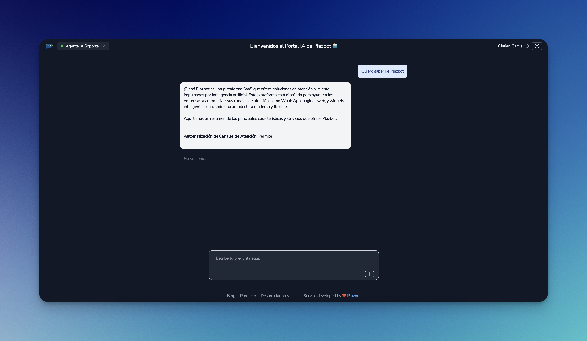
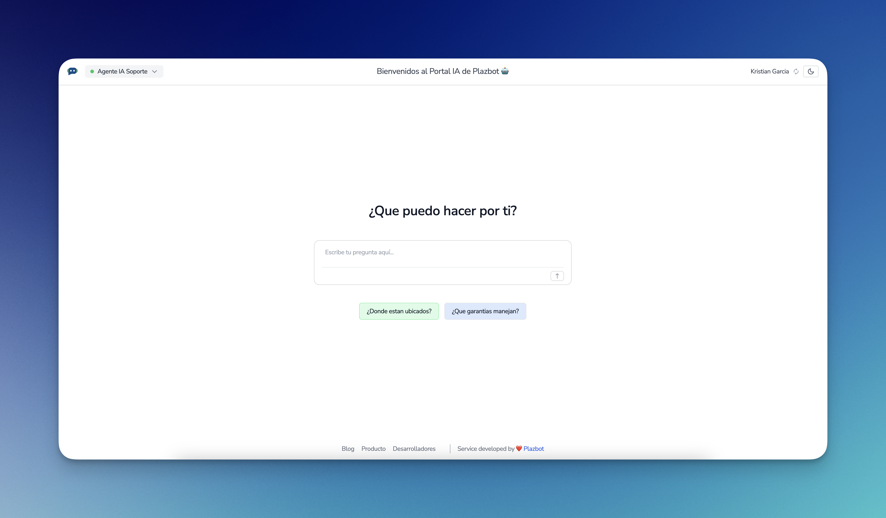
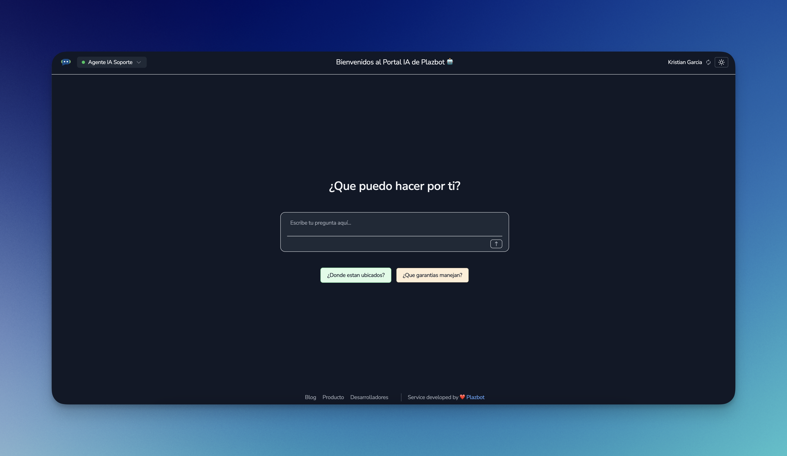
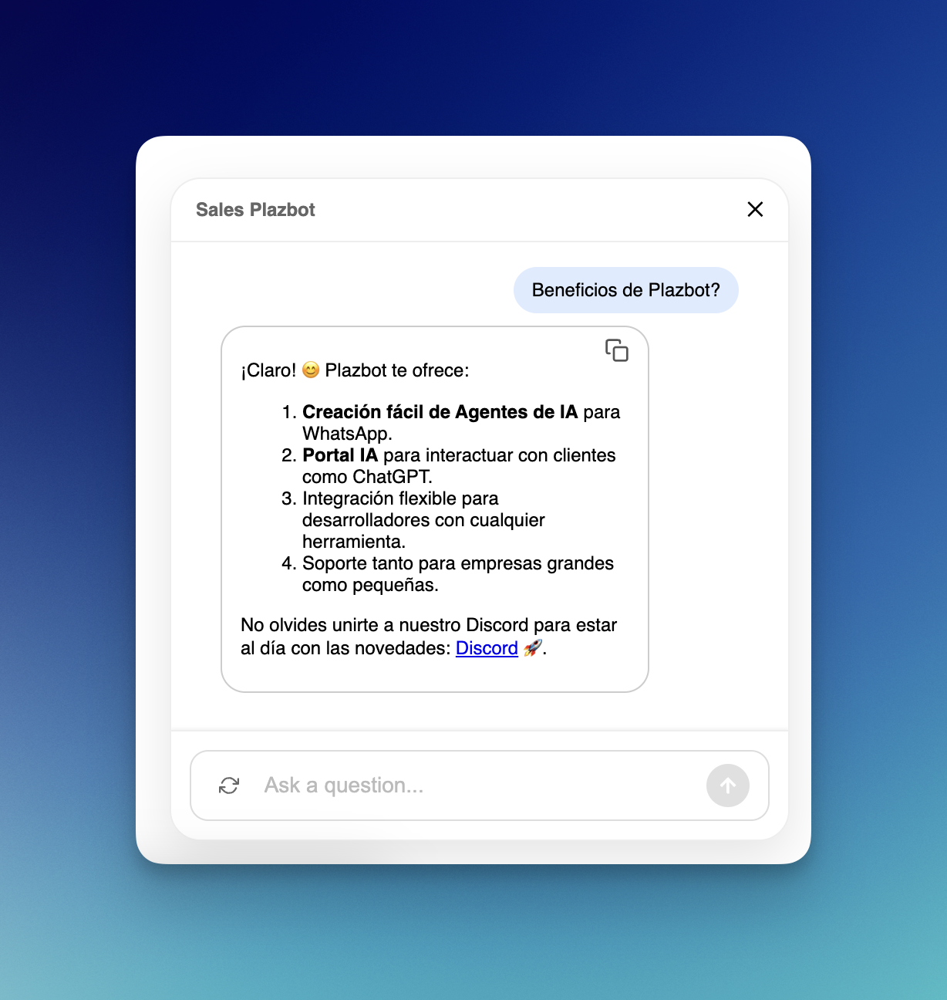
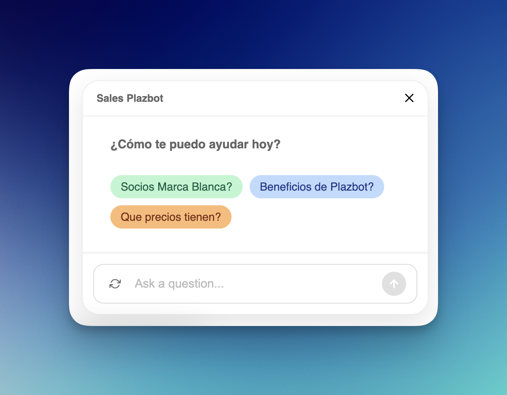
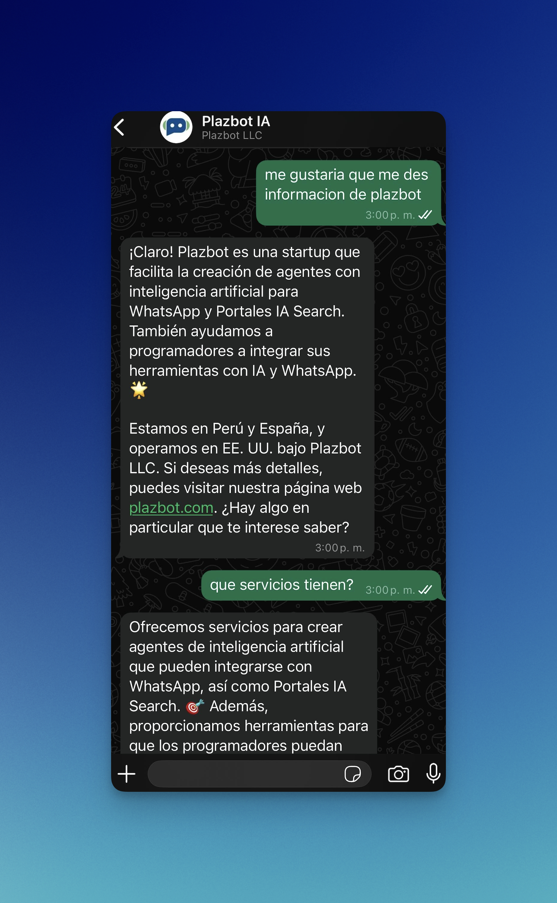

## 🚀 Plazbot SDK Examples

AI Agents and WhatsApp integration for developers using the Plazbot SDK.

---

## 🤖 Overview

With the **Plazbot SDK**, you can build powerful, production-ready AI agents in minutes and connect them seamlessly to:

- 🌐 **Search Portals (ChatGPT-style AI search for websites)**
- 💬 **WhatsApp Messaging**
- 💻 **Web Widgets (fully embeddable)**

With just a few lines of code, you can:

- Create an agent with its own prompt, examples, and visual branding.
- Connect it to any supported channel.
- Start receiving and responding to messages with AI instantly.

The SDK is designed for developers who want to ship intelligent agents fast — whether for their own product or as part of a scalable solution for clients.

---

> 🧪 We’re currently in **Beta** for Plazbot SDK 2.0. Join the community and get free months, discounts, and early access perks. [Learn more ↓](#-lets-build-the-future-of-ai-agents--together)

---

## 💻 Roadmap

The Plazbot SDK is being developed with a RAG (Retrieval-Augmented Generation) architecture, allowing developers to combine:

- Uploaded files (PDFs, documents, etc.)
- External services via APIs
- Custom prompts configured in the agent

Our orchestrator will intelligently decide the best source of information to respond to each user message.

Roadmap:
- Files for AI Agent
- APIs for AI Agent

---

## Installation

```bash
npm install plazbot
```

---

## Initialization

```ts
import { Agent, Portal, Message } from 'plazbot';

const bot = new Agent({
  workspaceId: "[YOUR_WORKSPACE_ID]",
  apiKey: "[YOUR_API_KEY]",
  zone: "LA" // Use "EU" for Europe
});

const portal = new Portal({
  workspaceId: "[YOUR_WORKSPACE_ID]",
  apiKey: "[YOUR_API_KEY]",
  zone: "LA" // Use "EU" for Europe
});

const message = new Message({
  workspaceId: "[YOUR_WORKSPACE_ID]",
  apiKey: "[YOUR_API_KEY]",
  zone: "LA" // Use "EU" for Europe
});
```

---

### **Agent Methods**

### Add Agent
The agent is the most important part of the SDK. Here, you'll be able to create AI agents with certain characteristics and deploy them across different channels, whether it's the AI ​​Portal, Widget, or WhatsApp. You can also use our agent in any of your internal business tools, if you wish.

```ts
    const agent = await bot.addAgent({
      name: "Sales Plazbot",
      prompt: promptServicioCliente,
      buffer: 5,
      zone: "LA",
      color: "orange", // 'orange' | 'blue' | 'green' | 'gray' | 'white';
      question: "¿How can I help you?",
      description: "Plazbot Sales and Customer Service Agent",
    });

    const agentId = agent.agentId;
```
Remember that the prompt is a text variable that you can send from any of your software and use it to deploy AI agents.

```ts
    const promptServicioCliente = `
    You are the Customer Service and Sales Agent at Plazbot. The goal is for you to always respond in a friendly manner, using emoticons, but not too many, just subtly based on the information I'm about to provide. Please don't answer too long. Be precise, but also provide clear information.

    Plazbot is a startup with the sole purpose of providing simple and extremely easy ways to create AI Agents for WhatsApp, AI Search Portals, and also helping programmers create AI Agents to integrate their tools with WhatsApp and Artificial Intelligence.

    Plazbot is a startup founded in Peru. Its CEO, Kristian García, founded it in 2021, and over the past few years, we've focused on creating AI Agents and Chatbots for WhatsApp.

    We are located in Peru and Spain. The company was also founded in the United States under the name Plazbot LLC.

    The information we provide is as follows, based on our links:
    - General platform information: www.plazbot.com
    - Twitter: https://twitter.com/plazbotia
    - LinkedIn: https://www.linkedin.com/company/plazbotcrm
    - Blog: https://www.plazbot.com/blog
    - Discord: https://discord.gg/VrxHbj4h
    - Development Roadmap: https://plazbot.canny.io/sdk-requests
    - Changelog: https://plazbot.featurebase.app/en/changelog
    - Documentation: https://plazbot.featurebase.app/en/help
    .`;
```
**AI Agent Fields**

| Name            | Description |
|-----------------|-------------|
| name            | Agent name. Visible text for identification. |
| prompt          | Custom instructions that define the agent's behavior. |
| buffer          | Number of messages stored to maintain context of a conversation, their values ​​range from 3 to 10 contexts. |
| color           | Visual color of the agent in the widget or portal. Options: blue, orange, gray, green, and white. Default: gray |
| question        | The Agent's main question, this question is the one that appears in the middle of the portal and also when you install the widget. |
| description     | AI Agent Description |
| zone            | The zone is a very important factor; it must match the zone in which the account is created. It can be of two types: LA /EU (Latam/Europe). |

### Add Example
Adds a quick reply example to the agent. Maximum: 5.

```ts
    await bot.addExample({ id: agentId, example: "Where are they located?", color: "green" });
    await bot.addExample({ id: agentId, example: "What guarantees do you offer?", color: "blue" });
```

### Clear Examples
Removes all examples associated with the specified agent.

```ts
    await bot.clearExamples(agentId);
```

### Get Agents
Returns all agents within the workspace.

```ts
    const agents = await bot.getAgents();
    console.log("🧠 Agents:", agents);
```

### Get Agent By Id
Fetches details of a specific agent by ID.

```ts
    const agentById = await bot.getAgentById({ id: agentId });
    console.log("📌 Agent by ID:", agentById);
```


### Update Agent
Updates agent settings like color, buffer, prompt, etc.

```ts
    // Update agent 
    await bot.updateAgent({
      id: agentId, 
      buffer: 7,
      color: 'blue',
    });
```

### Delete Agent
Deletes an agent and automatically removes its reference from any associated portals.

```ts
    // Delete Agent
    await bot.deleteAgent({
      id: agentId
    });
```

### Send Message to IA
Sends a message to the AI agent and receives a streamed response.

🚨 **Importat** - This is the most important function of the SDK. This function will always query the AI. Later, we will implement the RAG for the AI ​​and API services. This will always be the function that asks the AI ​​for what is needed.

If working with WhatsApp, you first query the AI, and then you send the result as a message using the Message module to your client or user.

```ts
    const sessionId = crypto.randomUUID();
    
    // 🧠 Query the agent's AI
    const response = await bot.onMessage({
      agentId: agentId, 
      question: "What features does Plazbot have?",
      sessionId: sessionId
    });

    console.log("💬 IA Response:", response);
```

### Activate/Desactivate Widget
Activate your widget for your website immediately with an agent feature. When you activate the Agent field, you'll receive a response with the script so you can install it.

This feature requires a separate update from the agent update, so if you use it in the general update, it won't deliver the script.


```ts
    const result = await bot.enableWidget({ id: agentId, enable: true });
    console.log("🤖 Widget State:", result);
```

---

### **Portal Methods**

### Add Portal
Creates a new portal with UI configuration (title, subtitle, branding, etc.).

🚨 **Importat** - It's very important to associate an agent with a Portal for it to work. The portal must have at least one associated Agent; otherwise, it won't load and will display a message. Association is done using the following method in this documentation.

✅ **Benefit** With this portal, you can have as many agents as you want: one Agent for Sales, another for Customer Service, another for Support, etc.

```ts
    const portalCreated = await portal.addPortal({
      name: "Portal Histórico",
      zone: "LA",
      title: "Consultas Históricas",
      subtitle: "Tu fuente de historia confiable",
      logo: "https://storage-files-plz-latam.s3.sa-east-1.amazonaws.com/master/logo-plazbot.png",
      logodark: "https://storage-files-plz-latam.s3.sa-east-1.amazonaws.com/master/logo-plazbot.png",
      access: "direct", // or "form",
      disabled: false, // Disable the portal
      brandOff: false, // Disable the plazbot brand
    });

     const portalId = portalCreated.id;
     const portalUrl = portalCreated.url;
```

**Portal Fields**

| Name            | Description |
|-----------------|-------------|
| name            | Portal name. Visible text for identification. |
| prompt          | Custom instructions that define the agent's behavior. |
| title           | It is the title that appears at the top of the portal. |
| subtitle        | Portal reference information. |
| logo            | Logo that appears in the upper left section when in light mode. |
| logodark        | Logo that appears in the upper left section when in dark mode. |
| access          | This is the way to access the portal: form / direct. Currently, we recommend working with direct, as we're still developing the "form" mode. If you need any functionality, please don't forget to leave it in our feedback section. |
| disabled        | Field that deactivates and activates the portal. |
| brandOff        | Field that hides the Plazbot greeting at the bottom of the portal. |
| zone            | The zone is a very important factor; it must match the zone in which the account is created. It can be of two types: LA /EU (Latam/Europe). |

- When the portal is created, it will send you the URL so you can log in and make queries to the AI ​​agent.

### Add Agent to Portal.
Links an existing agent to a portal.

```ts
    await portal.addAgentToPortal({
      portalId: portalId,
      id: agentId
    });
```

### Add Links to Portal
Adds an external link (e.g. "Blog") to the portal. Max 5 links allowed. The links will be displayed below the portal and will be configured to open in another screen.

```ts
     //Add a link to the portal
    await portal.addLinkToPortal({
      portalId: portalId,
      value: "Blog Plazbot",
      url: "https://www.plazbot.com/Blog"
    });

     //Add a link to the portal
    await portal.addLinkToPortal({
      portalId: portalId,
      value: "Discord Plazbot",
      url: "https://discord.gg/Y8f38MxF"
    });

     //Add a link to the portal
    await portal.addLinkToPortal({
      portalId: portalId,
      value: "Plazbot",
      url: "https://www.plazbot.com"
    });
```


### Get Portal By Id
Fetches portal details by ID.

```ts
   const portalInfo = await portal.getPortal(portalId);
    console.log("🔍 Portal:", portalInfo);
```


### Clear Links
Removes all configured links from the portal.

```ts
    // Clear links of the portal
    await portal.clearLinks(portalId);
```

### Update Portal
Updates portal metadata (name, logo, branding).

```ts
   // Update portal
    await portal.updatePortal({
      id: portalId, 
      name: "Plazbot Portal Updated"
    });
```

### Delete Portal
Deletes the specified portal.

```ts
   // Delete portal
    await portal.deletePortal(portalId);
```

---

### **Whatsapp Methods**
To work with WhatsApp, it's important to be able to configure the number in Plazbot. The configuration is done directly with Meta, so there shouldn't be any issues during the process. We can also help you associate the number through our communication channels, such as support@plazbot.com or Discord.

👉 [[(Whatsapp Configuration)](https://plazbot.featurebase.app/en/help/articles/6674271-conectar-numero-de-whatsapp)]

### Send Whatsapp Message 
This feature is for sending simple WhatsApp messages. If you want to host a chat on your platform, app, or other site, this feature will allow you to record incoming and outgoing messages. This simple message is used when the conversation with the client is already active. You won't be able to send a simple message if the client is new or hasn't responded to you within 24 hours of your last conversation, or the timeframe they have.

I'm also providing the Meta documentation so you can review how their messaging works, its timing, and rates.

👉 [[(Meta Pricing and Conversation)](https://developers.facebook.com/docs/whatsapp/pricing)]

```ts
   // Whatsapp message
    const whatsapp = await message.onWhatsappMessage({
      message: "What features does Plazbot have?",
      to: "52123456789" //"sessionId12345" // sessionId
    });
     console.log("💬 IA Response:", whatsapp);
```


### Send Whatsapp Conversation
When sending WhatsApp conversations, it's important to be able to create the template in Plazbot.

Marketing Section -> Templates.

We're currently sending templates without variables; we're developing the ability to send templates with variables. Remember that when creating the template, you define the files to send, the type of template, etc. With this feature, you only send the template name, and the service takes care of the rest.

```ts
   // Send a template message
    const conversation = await message.onConversation({
      to: "52123456789", 
      template: "welcome_plazbot"
    });
```

### Register Webhook 
This feature will help you maintain a conversation with your user. Register your webhook, and every time the customer texts the number you configured, the message and reference information will be sent to your webhook. The webhook is only for Whatsapp functionality.

```ts
   await message.registerWebhook({
      number: '51966446311',
      webhookUrl: 'https://hook.us1.make.com/xxxxxxxx'
    });
```

### Delete Webhook
Remove the webhook from the number.

```ts
    await message.deleteWebhook({
      number: "51966446311"
    });
```

---

## Credentials

### Where to get your `API Key` and `Workspace ID`?

You can find both inside the [Plazbot Dashboard](https://www.plazbot.com) after login:

- Go to **Settings** > **API KEY**
- Copy your `API Key` and `Workspace ID`

Check out our documentation to learn how to create an account and retrieve your API Key and Workspace ID.
👉 [[(Developers)](https://docs.plazbot.com/sdk/introduccion)]
👉 [[(Crear una Cuenta)](https://docs.plazbot.com/guides/primeros-pasos/creacion-cuenta)]

---

## Visual Reference

Below are example screenshots of the Portal UI (light and dark mode):

### Portal


### Light Mode


### Dark Mode


### Widget 


### Widget Messages


### Whatsapp 


---

## NPM Page

For use NPM, visit:  
👉 [[(https://www.npmjs.com/package/plazbot)](https://www.npmjs.com/package/plazbot)]

---

---
## 🤝 Let’s Build the Future of AI Agents — Together

We’re currently in **Beta** for our new **Plazbot 2.0 SDK** — a platform designed to help developers easily create AI agents for:

- WhatsApp
- Web widgets
- Search portals
- Custom internal tools

If you're a developer, agency, or curious innovator, this is the perfect time to join us. Early adopters who help test and improve the SDK will receive:

🎁 **Free months**  
💸 **Lifetime discounts**  
💬 **Direct feedback channel with our core team**

---

### 📣 Get In Touch

For technical questions or support:  
📩 [support@plazbot.com](mailto:support@plazbot.com)

For partnerships, business, or sales inquiries:  
📩 [sales@plazbot.com](mailto:sales@plazbot.com)

Join our community and help us shape what comes next:  
[](https://discord.gg/Y8f38MxF)
[](https://twitter.com/plazbotia)
[](https://docs.plazbot.com/api-reference/introduction)


Together, let’s simplify and accelerate how AI gets delivered to the world.

---

---

## 💸 Release, Pricing & Beta Benefits

Plazbot 2.0 is currently in **Beta**, and we’re working closely with early adopters to improve the platform.

While pricing is still under review, **Plazbot is currently 100% free** during this beta period.

### 🧪 Planned Pricing (Post-Beta)

| Plan             | Users | Contacts        | Monthly | Annual (Discount) |
|------------------|--------|-----------------|---------|--------------------|
| Free             | 1      | 500             | $0      | $0                 |
| Professional     | 5      | 5,000           | $25     | $19/mo             |
| Business         | 10     | 10,000          | $35     | $29/mo             |
| Corporate        | Custom | Custom needs    | Custom  | Custom             |

> Additional User: **$10/month**  
> Extra Contacts:  
> – +10,000 → $49/mo  
> – +25,000 → $99/mo  
> – +50,000 → $149/mo  
> – +100,000 → $249/mo

### 🤖 SDK Licensing

Because the SDK makes use of RAG architecture, embeddings, prompt execution and external services, it will likely be included in the **paid plans** — although this is still under evaluation.

### 🎁 Special Offers for Beta Testers

Help us improve the SDK, report issues, suggest features, or stay active in our community and you'll get:

- ✅ Free platform usage months
- 💡 Permanent discounts on future plans
- 🤝 Priority support and early access to new features

For commercial deployments (Portal, Widget, or WhatsApp solutions), reach out to:  
📩 [sales@plazbot.com](mailto:sales@plazbot.com)

🤝 **White Label & Partner Opportunities**

If you’re an agency, developer, or SaaS company looking to offer AI-powered solutions under your own brand, Plazbot offers a white-label model during the beta phase.
	•	Use your own domain and branding
	•	Deploy agents for multiple clients
	•	Access to all features of the SDK
	•	Custom onboarding and commercial terms

---

## License

MIT License
